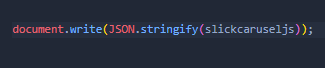

# ablyjsrepo
- Written to make popular javascript libraries better
- The software used in this js library completely belongs to the people who developed the software. this software is used to simplify js libraries again.
- Please refer to the [wiki](https://github.com/HACKERA316/ablyjsrepo/wiki) to use this software...
- Please use one of the following to add it to your website
     - [jsdelivr](https://cdn.jsdelivr.net/gh/HACKERA316/ablyjsrepo@latest/)  

     - [unpkg](unpkg.com/:package@:version/:file)

## how to install (currently under development can't be added yet)
   1. first add jsdelivr or unpkg library at the end of </body></body> to your website
   2. then add the jquery library (valid for 1.0.0-beta)
   3. then write these codes between the  files you add

----

## WARNING ABOUT THIS SOFTWARE
- MISUSE, MODIFICATION, EDITING, COPYING OF THIS SOFTWARE IS PROHIBITED. THE SOFTWARE USED IN THE JS LIBRARY IS ENTIRELY BELONGS TO THE COMPANY OR PERSON THAT DEVELOPED THE SOFTWARE. [HACKER316](https://github.com/HACKERA316) OWNS ONLY DEVELOPING THIS SOFTWARE

